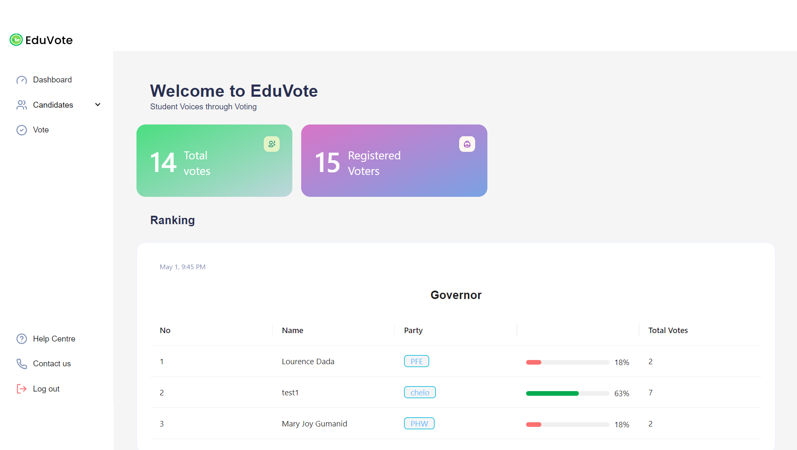
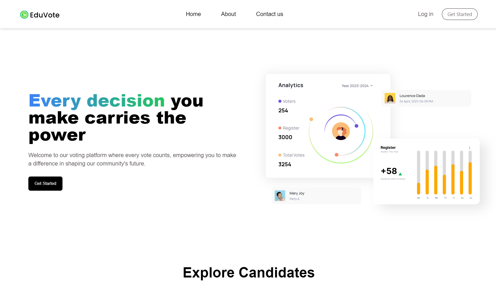

# IPT-EDUVOTE

<h3>Overview</h3>

The Voting System project is designed to facilitate various voting processes in an organized and efficient manner. It provides functionalities to create, manage, and conduct different types of elections, polls, or surveys.

<h3>Features</h3>
<ul>
  <li>User Authentication: Secure authentication system for users, ensuring only authorized individuals can participate in voting activities.</li>
<li>Create Elections: Ability to create new elections with customizable options and settings.</li>
<li>Manage Candidates: Easily add, edit, or remove candidates for each election.</li>
<li>Conduct Voting: Conduct voting processes, allowing registered users to cast their votes securely.</li>
<li>Results Generation: Automatically calculate and generate results for each election once voting is complete.</li>
<li>Customizable: Flexible configuration options to adapt to various voting scenarios and requirements.</li>
</ul>
